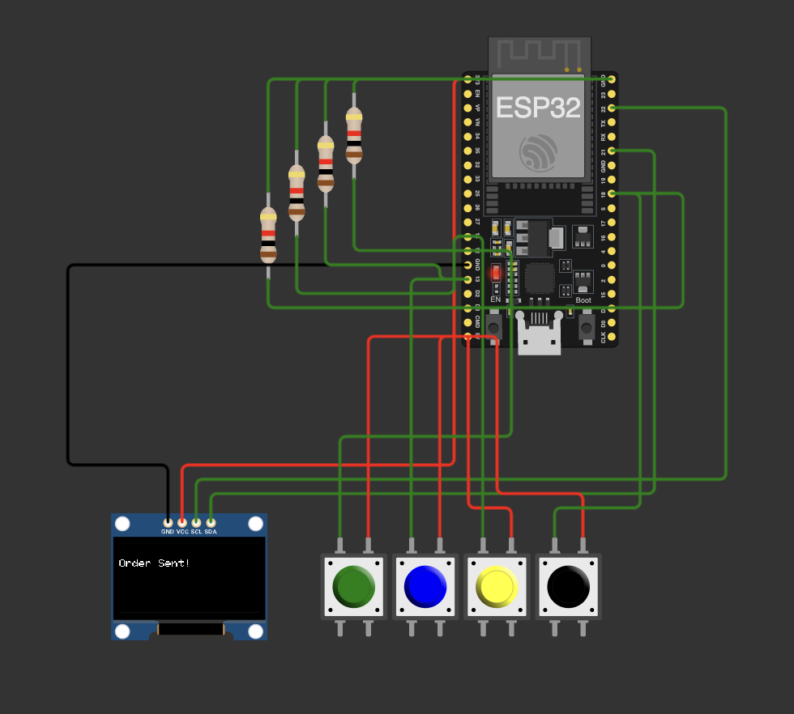
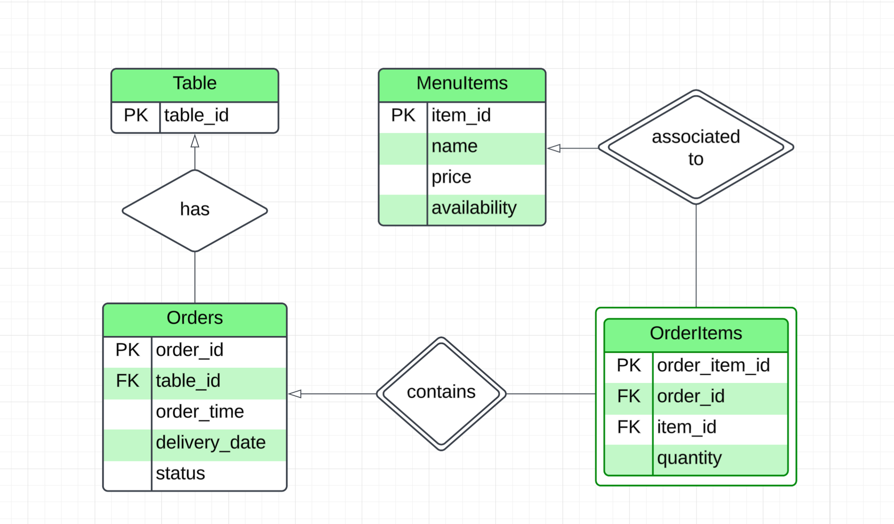
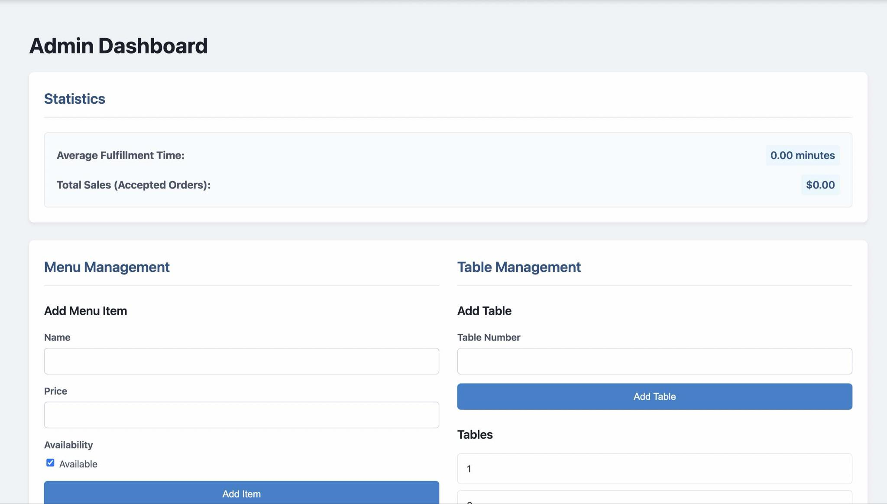

# Techathon Phase-01: Bistro 92 Challenge

Welcome to our submission for the Techathon Phase-01 competition. This project transforms the dining experience at Bistro 92 using smart ordering devices placed on every table.

## Submission Contents
- [Solutions to Quick Fixes, Tech Tricks, Bonus Boosters, and Big Idea](#quick-fixes)
- Hardware Simulation Code
- Video Demo Link: https://drive.google.com/drive/folders/1_bA339eUSc646bahWPDmTtxIswWvL8tg?usp=drive_link
- Wokwi Project Link: https://wokwi.com/projects/429404013375725569

---

# Project Setup

This project consists of a Node.js backend and a React frontend.

## Prerequisites

* Node.js (which includes npm) installed.
* A running PostgreSQL database instance.

## Backend Setup

1. *Navigate to the backend directory:*
    
    ```bash
    cd backend
    ```

2. *Install dependencies:*
    
    ```bash
    npm install
    ```

3. *Configure env*
    
    ```
    PORT=3000
    DB_HOST='localhost'
    DB_PORT='5432'
    DB_NAME='bistro92'
    DB_USER='bistro_user'
    DB_PASSWORD='bistro_password'
    // This is just some demo credentials
    ```

4. *Install postgres and create a Database 'bistro92' and User 'bistro_user' with a Password*

    ```bash
    psql -U bistro_user -d bistro92 -h localhost
    ```
5. *Grant full access to user 'bistro_user' to the Database 'bistro92'*
    ```bash
        ALTER DATABASE bistro92 OWNER TO bistro_user;
        GRANT ALL ON SCHEMA public TO bistro_user;
    ```

6. *Initialize database*
   ```bash
       node src/db/db_init.js
   ``` 
    
    
7. *Set up environment variables:*
    * Create a `.env` file in the backend directory.
    * Copy the contents of `.env.example` (if it exists) into `.env`.
    * Fill in your database connection details (`DATABASE_URL` or individual `DB_` variables) and any other required variables (like `JWT_SECRET`).

8. *Start the backend server:*
    
    ```bash
    npm start
    # Or:
    node src/index.js
    ```
    
    The backend should now be running (typically on http://localhost:3001 or the port specified in your `.env`).

## Frontend Setup

1. *Navigate to the frontend directory:*
    
    ```bash
    cd ../frontend
    # Or from the root:
    cd frontend
    ```
    
2. *Install dependencies:*
    
    ```bash
    npm install
    ```
    
3. *Start the frontend development server:*
    
    ```bash
    npm run dev
    ```
    
    The frontend application should open in your browser (typically on http://localhost:3000). It will connect to the backend API running locally.

---

# ESP32 Menu System

A menu system using ESP32 DevKit V1, SSD1306 OLED (128x64, I2C), and 4 push buttons.

## Components
- **ESP32 DevKit V1**: WiFi and control.
- **SSD1306 OLED**: Displays menu and status.
- **Buttons**:
  - Menu/Reset (GPIO 12)
  - Select/Submit (GPIO 13)
  - Scroll Up (GPIO 14)
  - Scroll Down (GPIO 18)

## Connections
### OLED
| Pin | ESP32 Pin |
|-----|-----------|
| VCC | 3.3V      |
| GND | GND       |
| SDA | GPIO 21   |
| SCL | GPIO 22   |

### Buttons
Each button connects to its GPIO (12, 13, 14, 18) and GND. Use `INPUT_PULLUP`.

## Circuit Diagram


## Notes
- **Power**: OLED uses ESP32 3.3V. Power ESP32 via USB or 5V VIN.
- **Pins**: GPIO 21/22 for I2C, 12/13/14/18 for buttons. Avoid GPIO 0/2.
- **Code**: Set `pinMode(pin, INPUT_PULLUP)` for buttons. Use `Adafruit_SSD1306` for OLED.
- **Wokwi**: Verify pins and grounding for physical setups.

## Usage
1. Connect circuit.
2. Upload code to ESP32.
3. Navigate menu with buttons; view status on OLED.

## Troubleshooting
- **OLED Failure**: Check 3.3V, GND, SDA/SCL, I2C address (0x3C).
- **Button Issues**: Verify GPIO, `INPUT_PULLUP`, and connections.

---

# Pipeline Architecture

## Pipeline Diagram
```plaintext
┌─────────────────┐       HTTP/WebSocket       ┌─────────────────┐
│   Smart Pad     │ <────────────────────────> │   Backend API   │
│ (ESP32 Device)  │ ────── Order Data ───────> │ (Cloud Server)  │
└─────────────────┘ <────── Status Updates ────└─────────────────┘
       ▲                                               │
       │                                               │
       │ WebSocket/HTTP                                │ Database Sync
       │                                               ▼
┌─────────────────┐       HTTP/WebSocket       ┌─────────────────┐
│   Frontend      │ <────────────────────────> │   Backend API   │
│ (Admin Dashboard │ <─── Real-time Orders ─── │ (Cloud Server)  │
│ / Customer UI)   │ ──── Inventory Updates ─> │                 │
└─────────────────┘                            └─────────────────┘
```

## Key Flows:

### Smart Pad ↔ Backend API

#### Smart Pad to Backend:
- The Smart Pad sends order data to the backend via HTTP POST or RESTful API. 
- The payload typically includes the table ID and the items ordered, including quantities.

#### Backend to Smart Pad:
- The backend sends order confirmations or status updates to the Smart Pad, such as "Order received" or "Order being prepared."
- These updates are communicated via HTTP responses or WebSocket connections.

### Backend API ↔ Frontend (Admin/Customer UI)

#### Backend to Frontend:
- The backend provides real-time order updates to the frontend dashboard via WebSocket or polling.
- The system also keeps the frontend updated with inventory status and order tracking.

#### Frontend to Backend:
- The frontend may send manual order overrides or cancellations to the backend. 
- Other functionalities such as real-time monitoring and updates are also managed via backend interactions.

### Backend Internal Flow

#### Database Operations:
- The backend uses databases like PostgreSQL to persist order information and track inventory status.

#### Kitchen Notifications:
- The system pushes real-time notifications to the kitchen whenever a new order is placed or updated. These notifications may be handled via WebSocket or push notifications.

---

# Quick Fixes

### Q1: Three Essential Features
1. **Interactive Menu Navigation** - Easy browsing and item selection.
2. **Real-time Order Syncing** - Instant cloud updates to kitchen.
3. **Admin Dashboard** - Real-time monitoring of orders, sales, and table statuses.

### Q2: Two Intuitive Design Principles
1. **Minimalist UI** - Simple, clutter-free display.
2. **Feedback Mechanisms** - Immediate visual or auditory feedback on button presses.

### Q3: Three Security Vulnerabilities & Solutions

| Vulnerability          | Problem                                 | Solution |
|-------------------------|-----------------------------------------|----------|
| Order Tampering         | Fake/modified orders                   | Use digital signatures |
| Theft of Device         | Device physically stolen               | Lock the device securely |
| Wi-Fi Eavesdropping     | Data interception over Wi-Fi           | Encrypt with HTTPS/TLS |

### Q4: Two Stability Strategies
1. **Local Caching** - Temporarily store orders locally and batch-send to cloud if network lags.
2. **Asynchronous Processing** - Use non-blocking order submission with retry mechanisms to avoid UI freeze.

### Q5: Inventory System Integration
## Middleware API Integration:
Build a lightweight middleware service that acts as a bridge between the smart pad ordering system and the existing inventory management system. This service would:

#### 1. Real-Time Stock Updates
- Automatically reduces stock quantities whenever an order is placed, keeping the inventory up-to-date and accurate at all times. This ensures the restaurant operates with correct stock levels and prevents stock discrepancies.

#### 2. Background Synchronization
- In case of network issues, the system temporarily caches the inventory updates locally. Once connectivity is restored, the updates are synchronized with the inventory management system, ensuring continuity of operations without data loss.

#### 3. REST API Communication
- The middleware interacts with the inventory system using secure REST APIs to push and pull data. This avoids direct manipulation of the inventory database, ensuring its integrity and security while enabling smooth data exchange.

#### 4. Transaction Logging
- Every inventory change is logged in a separate audit trail, providing traceability for each transaction. This ensures that any issues can be traced, and changes can be easily rolled back if needed.

### Benefits
This approach guarantees a non-intrusive, efficient integration of the smart pad ordering system with the inventory management system, improving inventory accuracy and providing full transparency while ensuring the smooth operation of the restaurant.

---

# Tech Tricks

### Q1: Database Schema



### Q2: SQL Query for Last Hour's Orders
```sql
SELECT 
    o.table_id AS table_number,
    mi.name AS item_name,
    o.order_time
FROM 
    Orders o
JOIN 
    OrderItems oi ON o.order_id = oi.order_id
JOIN 
    MenuItems mi ON oi.item_id = mi.item_id
WHERE 
    o.order_time >= NOW() - INTERVAL '1 hour'
ORDER BY 
    o.order_time DESC;
```

### Q3: Real-Time Kitchen Notifications

## Tech Stack

- **Frontend**: 
  - ESP32 (communicates via HTTP or WebSocket)

- **Backend**:
  - Node.js with Express

- **Realtime Updates**:
  - PostgreSQl (with real-time subscriptions)

## Description

A system designed to provide real-time notifications to the kitchen whenever a new order is placed or updated.  
The ESP32 microcontroller acts as the client device, sending or receiving data through HTTP requests or WebSocket connections.  
The backend server handles communication, processes incoming orders, and pushes real-time updates either through PostgreSQL.

### Q4: Cloud-Based Architecture
## Tech Stack

- **Smart Pad Communication**:
  - Device communicates with the backend over HTTPS or WebSocket for real-time interaction.

- **Backend**:
  - Built with either Node.js (Express framework) to handle API requests, real-time messaging, and business logic.

- **Database**:
  - Data is stored and managed using PostgreSQL.

- **Frontend Dashboard**:
  - Developed using React, with WebSocket integration for live updates and real-time order/status monitoring.

- **Hosting and Infrastructure**:
  - Deployed on Google Cloud Platform (GCP) with Auto-scaling enabled to handle load variations.
  - Load Balancers ensure high availability and efficient traffic distribution across server instances.

## Description

This architecture supports a fully cloud-based solution where smart devices (Smart Pads) interact with backend services seamlessly and dashboards reflect changes in real-time. The system is designed to be scalable, resilient, and responsive to high traffic loads using modern cloud infrastructure.

### Q5: Real-Time Dashboard Tools
The following dashboard provides real-time data and management features for the kitchen:

- **Pending Orders**: Displays the number of orders that are yet to be fulfilled.
- **Completed Orders**: Shows the number of orders that have been successfully fulfilled.
- **Average Fulfillment Time**: Shows the average time taken to complete an order.
- **Total Sales**: Displays the total sales amount for the current period.
- **Kitchen Management**: Allows admins to **add** or **remove menu items** dynamically from the system.

### Tools and Justifications

- **Frontend**: 
  - **React**: Chosen for building a dynamic, responsive user interface, ideal for real-time updates and interactive elements like dashboards.
  
- **Backend**:
  - **Node.js with Express**: Provides a lightweight, high-performance backend suitable for handling real-time requests and managing APIs for order and menu management.
  
- **Real-Time Communication**:
  - **Socket.IO**: Enables real-time, bidirectional communication between the server and frontend, essential for updating orders, sales, and statuses instantaneously.

- **Database**:
  - **PostgreSQL**: PostgreSQL ensures robust data handling and simplifies backend operations, providing authentication, real-time subscriptions, and database management.

This stack ensures a scalable, efficient, and interactive dashboard that can handle high-volume orders and kitchen management tasks in real time.


---

# Bonus Boosters

### Q1: RESTful API for Order Placement

## Table of Contents
- [Public Menu Endpoint](#public-menu-endpoint)
- [Admin Endpoints](#admin-endpoints)
  - [Menu Items](#menu-items)
  - [Tables](#tables)
- [Order Endpoints](#order-endpoints)
- [Statistics Endpoint](#statistics-endpoint)
- [Additional Endpoints](#additional-endpoints)

---

## Public Menu Endpoint

### `GET /api/menu`
- **Description**: Fetches a list of currently available menu items (`item_id` and `name` only).
- **Intended For**: Hardware devices.

---

## Admin Endpoints

### Menu Items

- **GET `/api/admin/menu-items`**
  - Fetch all menu items with full details (ID, name, price, availability).

- **POST `/api/admin/menu-items`**
  - Add a new menu item.
  - **Body Parameters**:
    - `name` (string, required)
    - `price` (number, required)
    - `availability` (boolean, optional; defaults to `true`)

- **PUT `/api/admin/menu-items/:itemId`**
  - Update an existing menu item by ID.
  - **URL Params**:
    - `itemId` (integer)
  - **Body Parameters** (optional):
    - `name` (string)
    - `price` (number)
    - `availability` (boolean)

- **DELETE `/api/admin/menu-items/:itemId`**
  - Delete a menu item by ID.
  - **URL Params**:
    - `itemId` (integer)

---

### Tables

- **GET `/api/admin/tables`**
  - Fetch all existing table numbers.

- **POST `/api/admin/tables`**
  - Add the next sequential table number automatically.

- **DELETE `/api/admin/tables/last`**
  - Delete the table with the highest table number.

---

## Order Endpoints

- **POST `/api/orders`**
  - Create a new order with status `pending`.
  - **Body Parameters**:
    - `tableNumber` (integer, required)
    - `items` (array of objects, each with `itemId` (integer) and `quantity` (integer > 0))

- **GET `/api/orders`**
  - Fetch a list of orders.
  - **Optional Query Parameters**:
    - `status` (string, e.g., `'pending'`, `'delivered'`)

- **PUT `/api/orders/:orderId/deliver`**
  - Mark a `pending` order as `delivered` and set its `delivery_time`.
  - **URL Params**:
    - `orderId` (integer)

---

## Statistics Endpoint

- **GET `/api/statistics`**
  - Fetch real-time order statistics for the past hour.
  - **Returns**:
    - `averageFulfillmentMinutesPastHour`
    - `totalSalesPastHour`
    - `deliveriesPerMinutePastHour` (array of `{ minute, count }`)

---

## Additional Endpoints

- **POST `/order`**
  - Create a new order.

- **GET `/order/:id`**
  - Fetch an order by its ID.

- **POST `/order/:id/items`**
  - Add items to an existing order.

- **POST `/order/submit`**
  - Submit an order for processing.

---

### Q2: Extreme Scalability Strategies

#### 1. **Load Balancers (NGINX, HAProxy)**
   - **NGINX/HAProxy** are used to distribute incoming traffic evenly across multiple instances of the application. This prevents any single server from being overwhelmed, ensuring high availability and fault tolerance.

#### 2. **Microservices Architecture**
   - A **Microservices Architecture** is employed to break the application into smaller, independently deployable services (e.g., Order Service, Payment Service, Inventory Service). Each microservice can be scaled independently, improving overall performance and resilience.

#### 3. **Message Queues (Kafka/RabbitMQ)**
   - **Kafka** or **RabbitMQ** are used for asynchronous communication between services. This ensures that even during traffic spikes, the orders are processed in a queue, preventing data loss and ensuring messages are not lost when systems experience delays.

#### 4. **NoSQL Databases with Partitioning**
   - A **NoSQL Database** (like **MongoDB** or **Cassandra**) is used to store orders and other unstructured data, with data partitioning techniques (sharding) to distribute the load across multiple database nodes. This enables horizontal scalability, improving performance during high-load situations.

#### 5. **Rate Limiting and Horizontal Scaling**
   - **Rate Limiting** ensures that the system can handle sudden spikes in traffic without getting overwhelmed, by limiting the number of requests from a single client in a given time period.
   - **Horizontal Scaling** allows the system to add more servers or containers as demand increases, distributing the load and increasing the system’s overall capacity to handle more simultaneous orders.
---

# Big Idea

### Smart Dietary Filter and Allergy Detection System

**Problem**:  
- Difficulty for customers with dietary restrictions or allergies.

**Solution**:  
- Add a smart filter to the ordering pad, allowing users to:
  - Select dietary preferences (e.g., Vegan, Gluten-Free)
  - Mark allergens (e.g., nuts, dairy)
  - Automatically filter or flag menu items accordingly.

**Impact**:  
- Healthier and safer dining experience  
- Improved customer satisfaction  
- Personalized menu navigation

---

### Language Barrier/Confusion for Non-Native or Foreign Customers

**Problem**:  
- Language barrier or confusion for non-native or foreign customers when navigating the menu or placing orders.

**Solution**:  
- Add a **multilingual voice assistant** powered by **ESP32** and **Google Cloud Text-to-Speech API**.
  - Detect the table’s language preference or offer a selection at the beginning.
  - Each item on the menu can be read out loud in the selected language, ensuring customers understand the options available.

**Why it Matters**:  
- Enhances accessibility for a diverse customer base.
- Reduces mistakes due to miscommunication.
- Personalizes the dining experience for customers of different linguistic backgrounds.
